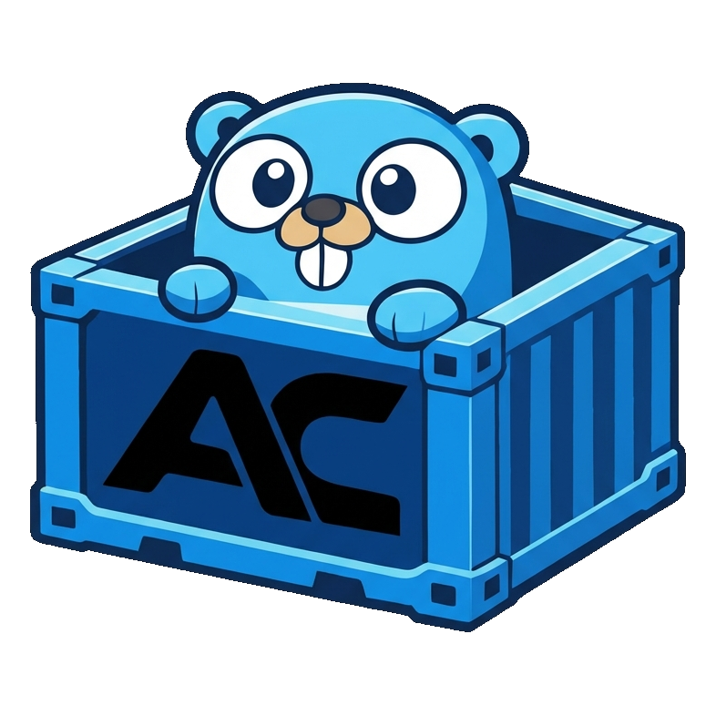
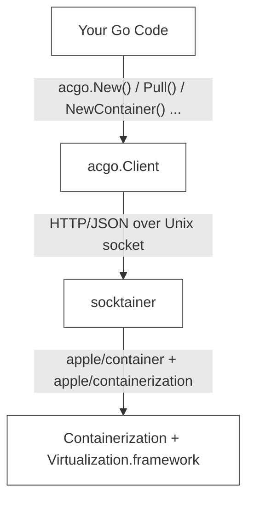

# acgo

<p align="center">
  
</p>

Go SDK for [Apple Container](https://github.com/apple/container). Talks to [socktainer](https://github.com/socktainer/socktainer) over a Unix socket, gives you a containerd v2-flavored API.

```
go get github.com/felinics/acgo
```

## How it works




acgo is a go client library. It doesn't manage daemons, doesn't shell out, doesn't vendor Swift code. It speaks the Docker API that socktainer already exposes.

## Requirements

- macOS 26 on Apple Silicon
- Go 1.25+
- [socktainer](https://github.com/socktainer/socktainer) (`brew tap socktainer/tap && brew install socktainer`)

## Quick start

```go
package main

import (
    "context"
    "fmt"
    "log"

    "github.com/felinics/acgo"
)

func main() {
    client, err := acgo.New()
    if err != nil {
        log.Fatal(err)
    }
    defer client.Close()

    ctx := context.Background()

    // pull
    img, err := client.Pull(ctx, "docker.io/library/alpine:latest")
    if err != nil {
        log.Fatal(err)
    }
    fmt.Println("pulled:", img.Name(), img.Size())

    // create + start
    ctr, err := client.NewContainer(ctx, "hello",
        acgo.WithImage("alpine:latest"),
        acgo.WithCmd("echo", "hello from acgo"),
        acgo.WithAutoRemove(),
    )
    if err != nil {
        log.Fatal(err)
    }
    _ = ctr.Start(ctx)

    // wait + logs
    resCh, _ := ctr.Wait(ctx, "not-running")
    <-resCh

    rc, _ := ctr.Logs(ctx)
    defer rc.Close()
    // io.Copy(os.Stdout, rc)
}
```

## Managing socktainer

acgo ships a `socktainer.Manager` in a separate sub-package. It's optional -- use it when you want your Go program to own the daemon lifecycle instead of relying on a system-wide process.

```go
package main

import (
    "context"
    "log"

    "github.com/felinics/acgo"
    "github.com/felinics/acgo/socktainer"
)

func main() {
    ctx := context.Background()

    // Start socktainer if not already running.
    // If the socket is already alive, this is a no-op.
    mgr := socktainer.NewManager()
    if err := mgr.Start(ctx); err != nil {
        log.Fatal(err)
    }
    defer mgr.Stop() // only kills what it started

    // Wire the socket path into the client.
    client, err := acgo.New(acgo.WithSocketPath(mgr.SocketPath()))
    if err != nil {
        log.Fatal(err)
    }
    defer client.Close()

    ok, _ := client.IsServing(ctx)
    log.Println("serving:", ok)
}
```

`Manager` options:

```go
socktainer.NewManager(
    socktainer.WithBinary("/opt/homebrew/bin/socktainer"), // default: exec.LookPath
    socktainer.WithSocket("/tmp/my.sock"),                 // default: ~/.socktainer/container.sock
    socktainer.WithStartTimeout(15 * time.Second),         // default: 30s
)
```

Behavior:

- `Start` checks the socket with `/_ping`. If alive, records it as external and returns immediately.
- `Start` with a dead socket finds the binary, spawns it, polls until ready.
- `Stop` sends SIGTERM only if this Manager started the process. External daemons are left alone.

## Connecting to an existing socket

If socktainer (or anything Docker-API-compatible) is already running somewhere:

```go
client, _ := acgo.New(acgo.WithSocketPath("/var/run/my-container.sock"))
```

## API reference

### Client

```go
func New(opts ...Opt) (*Client, error)
func (c *Client) Close() error
func (c *Client) IsServing(ctx) (bool, error)
func (c *Client) Version(ctx) (system.Version, error)
func (c *Client) Info(ctx) (system.Info, error)
func (c *Client) DiskUsage(ctx) (system.DiskUsage, error)
func (c *Client) Events(ctx, ...EventsOpt) (<-chan system.Event, <-chan error)
```

### Container lifecycle

```go
func (c *Client) NewContainer(ctx, id, ...CreateOpt) (Container, error)
func (c *Client) LoadContainer(ctx, id) (Container, error)
func (c *Client) Containers(ctx, ...ListOpt) ([]Container, error)
func (c *Client) PruneContainers(ctx) ([]string, error)
func (c *Client) ContainerService() containers.Store
```

```go
type Container interface {
    ID() string
    Info(ctx) (containers.Container, error)
    Image(ctx) (Image, error)
    Labels(ctx) (map[string]string, error)
    Start(ctx, ...StartOpt) error
    Stop(ctx, ...StopOpt) error
    Kill(ctx, ...KillOpt) error
    Restart(ctx, ...RestartOpt) error
    Delete(ctx, ...DeleteOpt) error
    Wait(ctx, condition) (<-chan WaitResult, <-chan error)
    Exec(ctx, cmd, ...ExecOpt) (ExecResult, error)
    Logs(ctx, ...LogsOpt) (io.ReadCloser, error)
    Stats(ctx, ...StatsOpt) (system.Stats, error)
    Inspect(ctx) (containers.Container, error)
}
```

### Images

```go
func (c *Client) Pull(ctx, ref, ...PullOpt) (Image, error)
func (c *Client) Push(ctx, ref, ...PushOpt) error
func (c *Client) Build(ctx, io.Reader, ...BuildOpt) error
func (c *Client) GetImage(ctx, ref) (Image, error)
func (c *Client) ListImages(ctx, ...ImageListOpt) ([]Image, error)
func (c *Client) DeleteImage(ctx, ref, ...ImageDeleteOpt) error
func (c *Client) TagImage(ctx, source, target) error
func (c *Client) PruneImages(ctx) error
func (c *Client) ImageService() images.Store
```

```go
type Image interface {
    Name() string
    ID() string
    RepoTags() []string
    RepoDigests() []string
    Labels() map[string]string
    Size() int64
    Created() time.Time
    Info(ctx) (images.Image, error)
    Delete(ctx, ...ImageDeleteOpt) error
    Tag(ctx, repo, tag) error
}
```

### Networks

```go
func (c *Client) CreateNetwork(ctx, name, ...NetworkOpt) (network.Network, error)
func (c *Client) DeleteNetwork(ctx, id) error
func (c *Client) ListNetworks(ctx) ([]network.Network, error)
func (c *Client) InspectNetwork(ctx, id) (network.Network, error)
func (c *Client) ConnectNetwork(ctx, networkID, containerID) error
func (c *Client) DisconnectNetwork(ctx, networkID, containerID, force) error
func (c *Client) PruneNetworks(ctx) error
```

### Volumes

```go
func (c *Client) CreateVolume(ctx, name, ...VolumeOpt) (volume.Volume, error)
func (c *Client) DeleteVolume(ctx, name) error
func (c *Client) ListVolumes(ctx) ([]volume.Volume, error)
func (c *Client) InspectVolume(ctx, name) (volume.Volume, error)
func (c *Client) PruneVolumes(ctx) error
```

### Registry

```go
func (c *Client) RegistryLogin(ctx, username, password, server) error
```

## Functional options

```go
// container creation
acgo.WithImage("nginx:latest")
acgo.WithCmd("nginx", "-g", "daemon off;")
acgo.WithEntrypoint("/entrypoint.sh")
acgo.WithEnv("PORT", "8080")
acgo.WithPublish(8080, 80, "tcp")
acgo.WithVolume("/host", "/container")
acgo.WithNetwork("frontend")
acgo.WithLabel("app", "web")
acgo.WithTTY()
acgo.WithUser("nobody")
acgo.WithWorkdir("/app")
acgo.WithHostname("web-1")
acgo.WithAutoRemove()
acgo.WithPlatform("linux/arm64")
acgo.WithDNS("8.8.8.8")

// container operations
acgo.WithStopTimeout(10)
acgo.WithStopSignal("SIGTERM")
acgo.WithKillSignal("SIGKILL")
acgo.WithForceDelete()
acgo.WithRemoveVolumes()

// image pull
acgo.WithPullTag("3.19")
acgo.WithPullPlatform("linux/arm64")

// image build
acgo.WithBuildTag("myapp:latest")
acgo.WithDockerfile("build/Dockerfile")
acgo.WithNoCache()

// logs
acgo.WithLogsFollow()
acgo.WithLogsTail("100")
acgo.WithLogsSince("2025-01-01T00:00:00Z")

// exec
acgo.WithExecTTY()
acgo.WithExecStdin()
acgo.WithExecDetach()

// events
acgo.WithEventFilters(`{"type":["container"],"event":["start","die"]}`)
```

## Store interfaces

For code that needs a testable abstraction over container/image CRUD:

```go
func (c *Client) ContainerService() containers.Store
func (c *Client) ImageService() images.Store
```

```go
// containers.Store
type Store interface {
    Get(ctx, id) (Container, error)
    List(ctx, ...filters) ([]Container, error)
    Create(ctx, Container) (Container, error)
    Delete(ctx, id) error
}
```

These follow the same interface pattern as `containerd/v2/core/containers.Store` and `containerd/v2/core/images.Store`.

## Related

- [Memoh](https://github.com/felinics/Memoh) - Multi-Member, Structured Long-Memor， Containerized AI Agent System ✨

## License

Apache-2.0
